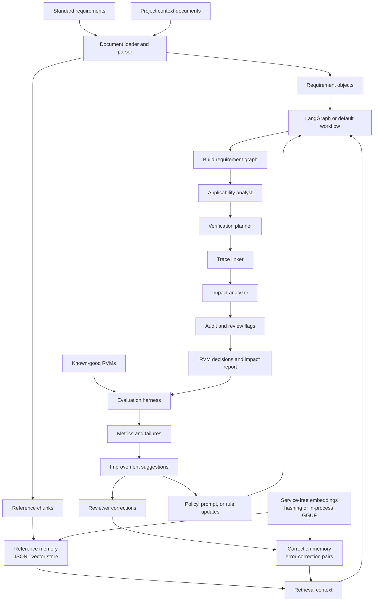

# LearningAgent

LearningAgent is an offline-first, model-agnostic workflow framework for reviewing structured documents. The first included task pack focuses on Requirements Verification Matrix (RVM) review:

- identify standard requirements that are not applicable to a project
- recommend verification methods
- build nested requirement trace links
- explain downstream impact of requirement changes
- evaluate workflow quality against known-good RVM examples

The framework does not require an API key. By default it uses deterministic local heuristics and file-backed memory. It does not require any local network service.

## Quick Start

Run the demo:

```powershell
python -m learning_agent.cli demo
```

Analyze your own files:

```powershell
python -m learning_agent.cli review-rvm `
  --standards examples/standards.csv `
  --project examples/project.txt `
  --engine default `
  --out out/review.json
```

Run the same workflow through LangGraph after installing optional graph dependencies:

```powershell
python -m learning_agent.cli review-rvm `
  --standards examples/standards.csv `
  --project examples/project.txt `
  --engine langgraph `
  --out out/review.json
```

Evaluate against good RVM documents:

```powershell
python -m learning_agent.cli evaluate-rvm `
  --gold examples/gold_rvm.csv `
  --pred out/review.json
```

Suggest offline improvements from failures:

```powershell
python -m learning_agent.cli suggest-rvm-improvements `
  --gold examples/gold_rvm.csv `
  --pred out/review.json `
  --standards examples/standards.csv `
  --project examples/project.txt `
  --out out/improvements.json
```

Crystallize a known-good RVM corpus into persistent learned memory:

```powershell
python -m learning_agent.cli learn-good-rvm `
  --gold examples/gold_rvm.csv `
  --standards examples/standards.csv
```

Index and search reference documents:

```powershell
python -m learning_agent.cli index-reference `
  --docs examples/standards.csv examples/project.txt

python -m learning_agent.cli search-reference `
  --query "wireless encryption requirement"
```

Store and search reviewer correction pairs:

```powershell
python -m learning_agent.cli add-correction `
  --task applicability `
  --input "wireless requirement for batch service" `
  --bad-output applicable `
  --corrected-output not_applicable `
  --rationale "Project has no wireless communication."

python -m learning_agent.cli search-corrections `
  --query "wireless applicability"
```

Index and search project working memory isolated to the current workspace:

```powershell
python -m learning_agent.cli index-project `
  --docs examples/project.txt `
  --workspace .

python -m learning_agent.cli search-project `
  --query "operator interface" `
  --workspace .
```

Show the persistent memory locations:

```powershell
python -m learning_agent.cli memory-paths --workspace .
```

The repo-contained GGUF embedding model is stored under Git LFS:

- `models/ollama/embeddinggemma/embeddinggemma.gguf`
- `models/ollama/embeddinggemma/Modelfile`

The default runtime uses `HashingEmbedder`, which is deterministic and service-free. For stronger in-process embeddings, install `.[local-gguf]` and pass `--embedder llama-cpp`. No local network host is used.

## Terminal Use

Everything is exposed through `python -m learning_agent.cli`, so it can be run from:

- VS Code terminals, including GitHub Copilot-assisted workflows
- Claude Code terminals
- PowerShell or any shell that can run Python

## File Formats

The parser supports:

- `.txt`, `.md`
- `.csv`
- `.tsv`
- `.json`
- `.xlsx` with `openpyxl`
- `.reqif`, `.reqifz`, `.xml` for DOORS/ReqIF-style exports

For `.docx` and `.pdf`, convert to Markdown/CSV first using a tool such as Microsoft MarkItDown, then run the workflow on the converted files.

## Architecture



Generic core:

- `learning_agent.core.workflow`: deterministic graph workflow runner
- `learning_agent.core.langgraph_workflow`: optional LangGraph execution adapter
- `learning_agent.core.models`: model adapter interface plus offline adapters
- `learning_agent.core.documents`: document loading and chunking
- `learning_agent.core.graph`: small property graph for traceability and impact analysis
- `learning_agent.core.embeddings`: hashing and in-process GGUF embedding adapters
- `learning_agent.core.vector_store`: JSONL vector store
- `learning_agent.core.memory`: reference and correction-pair memory
- `learning_agent.core.evaluation`: reusable classification/link/field metrics

Requirements task pack:

- `learning_agent.tasks.rvm.schema`: requirement/RVM data models
- `learning_agent.tasks.rvm.workflow`: extraction, applicability, verification, trace linking, impact analysis
- `learning_agent.tasks.rvm.evaluation`: RVM-specific scoring

Memory tiers:

- Reference memory: persistent reusable requirements/reference documents uploaded by the user.
- Crystallized memory: persistent good examples, reviewer corrections, and learned improvements.
- Workspace working memory: project-specific context isolated by workspace path so unrelated projects do not contaminate each other.

## Self-Improving Loop

The initial loop is deliberately simple and auditable:

1. Run the workflow on a set of historical projects.
2. Score against known-good RVMs.
3. Export failure cases.
4. Generate candidate improvements with `suggest-rvm-improvements`.
5. Update policy files, keyword rules, examples, or model prompts.
6. Re-run and compare metrics on a holdout set.

Later, you can plug in DSPy/GEPA, Ragas, DeepEval, local LLMs, or hosted models. The core workflow stores structured traces so optimizers can inspect failures without needing to know the internals of each node.

## Model Agnostic by Design

The workflow nodes accept a `ModelAdapter`, but the default path uses `NoOpModel` plus deterministic policies. That means it runs without API keys, network access, or local model servers. To add another inference backend, implement:

```python
class MyAdapter:
    name = "my-adapter"

    def complete(self, request):
        ...
```

Then pass it into `build_rvm_workflow(model=MyAdapter())` or `review_rvm(..., model=MyAdapter())`.

## Optional Dependencies

The base install stays dependency-free. Optional extras are:

```powershell
pip install -e ".[graph]"
pip install -e ".[ingestion]"
pip install -e ".[local-gguf]"
pip install -e ".[all]"
```

The runtime is designed to avoid local network hosts. Retrieval and memory are file-backed, and the optional GGUF embedder runs in process.
