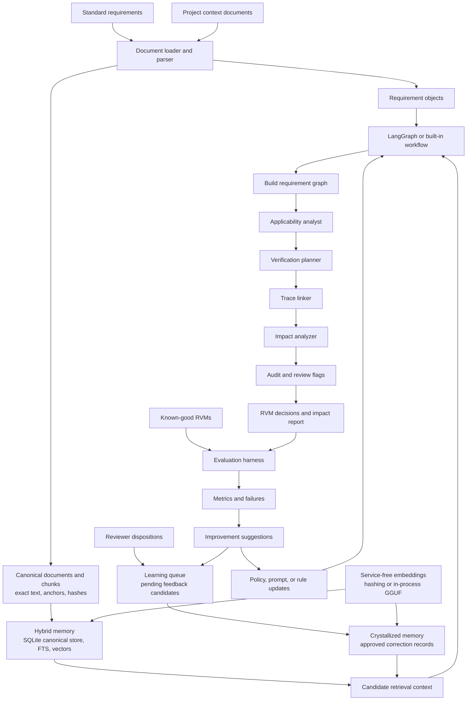

# LearningAgent

LearningAgent is an offline-first, model-agnostic workflow framework for reviewing structured documents. The first included task pack focuses on Requirements Verification Matrix (RVM) review:

- identify standard requirements that are not applicable to a project
- recommend verification methods
- build nested requirement trace links
- explain downstream impact of requirement changes
- evaluate workflow quality against known-good RVM examples

The framework does not require an API key. By default it uses deterministic local heuristics and file-backed memory. It does not require any local network service.
LangGraph is a normal project dependency and the default workflow engine.

For the full operational and compliance description, see [Workflow Assurance Guide](docs/workflow_assurance_guide.md).
For the local desktop control surface, see [Desktop UI Guide](docs/desktop_ui.md).

## Quick Start

Run the demo:

```powershell
python -m learning_agent.cli demo
```

Launch the desktop UI:

```powershell
python -m learning_agent.ui
```

On Windows, you can also run:

```powershell
.\run_ui.bat
```

The launcher checks for LangGraph, llama-cpp-python, and Excel ingestion support. If they are missing, it installs them from the checked-in offline wheelhouse under `vendor/wheels` using `--no-index`; it does not download packages or contact a package server.

Offline setup for terminals:

```powershell
powershell -ExecutionPolicy Bypass -File .\scripts\install_offline.ps1
```

The checked-in wheelhouse targets Windows amd64 with CPython 3.14. A different Python version or operating system needs a refreshed wheelhouse built on a compatible network-enabled machine with `scripts/build_offline_wheelhouse.ps1`.

Analyze your own files:

```powershell
python -m learning_agent.cli review-rvm `
  --standards examples/standards.csv `
  --project examples/project.txt `
  --workspace . `
  --out out/review.json
```

Drafting uses hybrid memory by default: current standards are indexed into shared canonical/reference memory, project context is indexed into workspace memory, requirements are resolved back to canonical records, crystallized corrections are searched for drafting hints, and graph relationships are persisted for trace and impact analysis. Add `--no-memory` for a stateless diagnostic run or `--no-index-memory` to retrieve from pre-curated memory without adding the current inputs.

Use the deterministic fallback runner if you explicitly do not want LangGraph execution:

```powershell
python -m learning_agent.cli review-rvm `
  --standards examples/standards.csv `
  --project examples/project.txt `
  --engine built-in `
  --out out/review.json
```

Evaluate against good RVM documents:

```powershell
python -m learning_agent.cli evaluate-rvm `
  --gold examples/gold_rvm.csv `
  --pred out/review.json
```

Run deterministic aerospace compliance checks:

```powershell
python -m learning_agent.cli audit-rvm-compliance `
  --rvm out/review.json `
  --out out/compliance_report.json
```

Export a controlled RVM CSV:

```powershell
python -m learning_agent.cli export-rvm-csv `
  --rvm out/review.json `
  --out out/review.csv
```

Hash evidence artifacts:

```powershell
python -m learning_agent.cli hash-evidence `
  --files evidence/ATR-102_Run4.log evidence/test-report.pdf `
  --out out/evidence_manifest.json
```

Record review or approval state:

```powershell
python -m learning_agent.cli record-approval `
  --rvm out/review.json `
  --state reviewed `
  --author-id jdoe `
  --role verification_lead `
  --justification "Reviewed against ATP-102 Rev B." `
  --out out/review_approval.json
```

Create a source/release manifest:

```powershell
python -m learning_agent.cli release-manifest `
  --out out/release_manifest.json
```

Export the exact worker agent definitions:

```powershell
python -m learning_agent.cli agent-definitions `
  --out out/agent_definitions.json
```

Suggest offline improvements from failures:

```powershell
python -m learning_agent.cli suggest-rvm-improvements `
  --gold examples/gold_rvm.csv `
  --pred out/review.json `
  --standards examples/standards.csv `
  --project examples/project.txt `
  --out out/improvements.json
```

Wrap improvement suggestions in a controlled proposal:

```powershell
python -m learning_agent.cli create-proposal `
  --improvements out/improvements.json `
  --author-id jdoe `
  --rationale "Holdout benchmark failure triage." `
  --out proposals/proposal-001.json
```

Crystallize a known-good RVM corpus into persistent learned memory:

```powershell
python -m learning_agent.cli learn-good-rvm `
  --gold examples/gold_rvm.csv `
  --standards examples/standards.csv
```

Index and search reference documents:

```powershell
python -m learning_agent.cli index-reference `
  --docs examples/standards.csv examples/project.txt

python -m learning_agent.cli search-reference `
  --query "wireless encryption requirement"

python -m learning_agent.cli search-reference `
  --query "The system shall encrypt wireless links" `
  --mode text

python -m learning_agent.cli get-requirement --id STD-002
```

Store and search reviewer correction pairs:

```powershell
python -m learning_agent.cli add-correction `
  --task applicability `
  --input "wireless requirement for batch service" `
  --bad-output applicable `
  --corrected-output not_applicable `
  --rationale "Project has no wireless communication."

python -m learning_agent.cli search-corrections `
  --query "wireless applicability"
```

Index and search project working memory isolated to the current workspace:

```powershell
python -m learning_agent.cli index-project `
  --docs examples/project.txt `
  --workspace .

python -m learning_agent.cli search-project `
  --query "operator interface" `
  --workspace .
```

Show the persistent memory locations:

```powershell
python -m learning_agent.cli memory-paths --workspace .
```

Repo-contained GGUF embedding model assets are stored under Git LFS:

- `models/llama-cpp/bge-small-en-v1.5-q4_k_m.gguf` (default llama-cpp embedder)
- `models/ollama/embeddinggemma/embeddinggemma.gguf`
- `models/ollama/embeddinggemma/Modelfile`

The default runtime uses `LlamaCppEmbedder` with the repo-contained BGE GGUF model. For a deterministic fallback, pass `--embedder hashing`. No local network host is used.

## Terminal Use

Everything is exposed through `python -m learning_agent.cli`, so it can be run from:

- VS Code terminals, including GitHub Copilot-assisted workflows
- Claude Code terminals
- PowerShell or any shell that can run Python

For interactive operation, run the desktop UI with `python -m learning_agent.ui` or the `learning-agent-ui` console script after installation. It is a local desktop process, not a hosted web interface.

## File Formats

The parser supports:

- `.txt`, `.md`
- `.csv`
- `.tsv`
- `.json`
- `.xlsx` with `openpyxl`
- `.reqif`, `.reqifz`, `.xml` for DOORS/ReqIF-style exports

For `.docx` and `.pdf`, convert to Markdown/CSV first using a tool such as Microsoft MarkItDown, then run the workflow on the converted files.

## Architecture



Generic core:

- `learning_agent.core.workflow`: deterministic fallback workflow runner
- `learning_agent.core.langgraph_workflow`: default LangGraph execution adapter
- `learning_agent.core.models`: model adapter interface plus offline adapters
- `learning_agent.core.documents`: document loading and chunking
- `learning_agent.core.graph`: property graph for traceability and impact analysis
- `learning_agent.core.embeddings`: hashing and in-process GGUF embedding adapters
- `learning_agent.core.memory`: hybrid canonical, full-text, vector, and graph-backed memory
- `learning_agent.core.evaluation`: reusable classification/link/field metrics

Requirements task pack:

- `learning_agent.tasks.rvm.agents`: versioned worker-agent system definitions
- `learning_agent.tasks.rvm.schema`: requirement/RVM data models
- `learning_agent.tasks.rvm.workflow`: extraction, applicability, verification, trace linking, impact analysis
- `learning_agent.tasks.rvm.evaluation`: RVM-specific scoring
- `learning_agent.tasks.rvm.compliance`: deterministic aerospace RVM compliance checks

Memory structure:

- Canonical memory: exact source documents, chunks, requirements, source anchors, hashes, and structured metadata.
- Full-text memory: deterministic phrase, identifier, acronym, and quoted-text search over canonical records.
- Vector memory: semantic discovery over canonical chunks and correction examples; vector hits are candidates only.
- Relationship graph memory: explicit relationships for traceability, coverage, impact analysis, waivers, and candidate links.
- Reference memory: persistent reusable requirements/reference documents uploaded by the user.
- Crystallized memory: persistent good examples, reviewer corrections, and learned improvements, stored as canonical correction records.
- Learning queue: pending, approved, and rejected feedback candidates captured from review and approval actions before they are crystallized.
- Workspace working memory: project-specific context isolated by workspace path so unrelated projects do not contaminate each other.

Vector retrieval is not the memory of record. Requirement text and evidence quotes must be retrieved word-for-word from canonical records by ID, source anchor, or full-text search. Semantic retrieval is useful for finding likely context, similar prior corrections, and candidate procedure references, but selected hits must resolve to exact canonical records before they can support RVM output.

## Aerospace Compliance Guardrails

The generated RVM is a draft until `audit-rvm-compliance` passes. The compliance auditor is deterministic and treats missing audit evidence as a failure, not a model-confidence issue.

Each production RVM entry must include:

- explicit parent requirement IDs
- explicit child requirement, implementation, or verification block IDs
- exactly one primary verification method: `test`, `demonstration`, `inspection`, or `analysis`
- exact procedure references with document and section anchors
- exact execution artifacts such as logs, signed reports, or file hashes
- objective bounded success criteria
- timestamped author-identified change rationale when applicability or method assumptions change
- assurance standard / certification basis, DAL, and lifecycle objective mapping

The auditor flags:

- orphan requirements
- combined methods such as `test/analysis`
- vague evidence references
- missing execution artifacts
- subjective terms such as `optimal`, `rapid`, `user-friendly`, or `sufficient`
- not-applicable decisions without architecture/boundary evidence
- missing assurance standard, DAL, or lifecycle objective mapping

Additional deployment controls:

- `hash-evidence` creates SHA-256 manifests for ATPs, ATRs, logs, reports, and code/design evidence.
- `export-rvm-csv` emits controlled CSV columns for official RVM review.
- `record-approval` captures drafted/reviewed/rejected/approved/baselined state with author, role, timestamp, justification, and RVM hash.
- `release-manifest` hashes tracked release artifacts for configuration management.
- `create-proposal` keeps training-derived changes in a proposed state until reviewed and versioned.

## Worker Agent Definitions

The workflow uses explicit, versioned worker definitions in `learning_agent.tasks.rvm.agents`.

Current agent set:

- Document Ingestion Agent
- Traceability Builder Agent
- Applicability Analyst Agent
- Verification Planner Agent
- Impact Analyzer Agent
- Compliance Auditor Agent

Every review artifact records the active `agent_set_id` and per-agent versions so an auditor can tell which definitions produced the result.

Automated training does **not** directly mutate these definitions. Training from known-good RVMs and human feedback may create proposed updates, but promotion requires:

- reviewed rationale
- validation against benchmark and holdout RVMs
- version bump
- committed change to the agent definition artifact
- updated audit evidence

This keeps learned behavior useful without allowing silent drift in compliance-controlled instructions.

## Self-Improving Loop

The initial loop is deliberately simple and auditable:

1. Run the workflow on a set of historical projects.
2. Score against known-good RVMs.
3. Export failure cases.
4. Generate candidate improvements with `suggest-rvm-improvements`.
5. Update policy files, keyword rules, examples, or model prompts.
6. Re-run and compare metrics on a holdout set.

Later, you can plug in DSPy/GEPA, Ragas, DeepEval, local LLMs, or hosted models. The core workflow stores structured traces so optimizers can inspect failures without needing to know the internals of each node.

## Model Agnostic by Design

The workflow nodes accept a `ModelAdapter`, but the default path uses `NoOpModel` plus deterministic policies. That means it runs without API keys, network access, or local model servers. To add another inference backend, implement:

```python
class MyAdapter:
    name = "my-adapter"

    def complete(self, request):
        ...
```

Then pass it into `build_rvm_workflow(model=MyAdapter())` or `review_rvm(..., model=MyAdapter())`.

## Dependencies

LangGraph and llama-cpp are included in the base project dependencies, so a normal project install sets up the default workflow engine and default GGUF embedder. Optional extras are:

```powershell
pip install -e ".[ingestion]"
pip install -e ".[all]"
```

The runtime is designed to avoid local network hosts. Retrieval and memory are file-backed, and the GGUF embedder runs in process.
